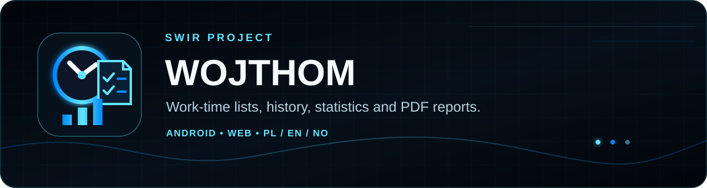
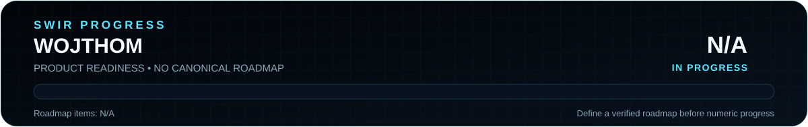
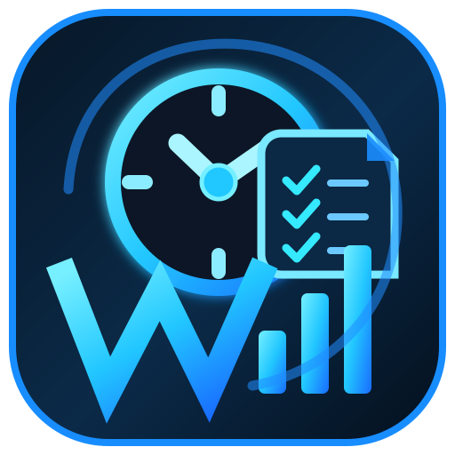

<!-- SWIR-README-STANDARD:v2 -->

# WojThom

**A local-first work-time list toolkit for Android and the browser.**

[**Highlights**](#-highlights) · [**Quick Start**](#-quick-start) · [**Compatibility**](#-requirements--compatibility) · [**Progress**](#-progress--release-status)

## 📍 Project Status

| Item | Current state |
|---|---|
| Current stage | Active development — Android `6.0.4-dev` plus the parallel web edition |
| Android | Kotlin + Jetpack Compose; `minSdk 26`, `targetSdk 36`, Java 17 |
| Web | Responsive HTML/CSS/JavaScript application with local browser storage |
| Latest public GitHub release | **Not published yet** |
| Product progress | **N/A** — no canonical measurable roadmap currently exists |

  

The progress graphic intentionally does **not** turn implementation activity into a made-up completion percentage. A numeric value can be introduced when the repository has an authoritative, verifiable roadmap. See [verification notes](docs/README-VERIFICATION.md).

## 🚀 Overview

**WojThom** turns work-time logs into structured entries, totals and reports. The repository contains two implementations developed around the same practical workflow:

- a native **Android** application built with Kotlin, Jetpack Compose and Material 3;
- a responsive **web** application that can run directly from local files in a modern browser.

Both editions focus on work-time entry, correction, history, statistics, multilingual use and PDF/report workflows while keeping normal working data on the user's device or browser storage.

## ✨ Highlights

| Feature | What it does |
|---|---|
| ⏱️ Work-log parsing | Handles time ranges such as `08:00 - 16:00`, decimal hours such as `7.5h`, and duration-style values such as `08:30`. |
| ✅ Validation and editing | Builds structured entries, flags invalid data, supports correction and lets users remove entries. |
| 🗃️ History | Saves work lists locally and lets users restore or delete previous snapshots. |
| 📊 Statistics | Tracks saved work data, including weekly/monthly summaries and the 37.5-hour weekly target in the current Android UI. |
| 📄 PDF / report workflow | Android writes PDF documents through the system document flow; the web edition prepares an A4 report for browser Print / Save as PDF. |
| 🌍 PL / EN / NO | Polish, English and Norwegian are implemented as application languages; PDF language can be selected separately in current workflows. |
| 🌗 Light / dark themes | Both editions provide a theme choice. |
| 💾 Local-first persistence | Android uses application-local storage; the browser edition uses `localStorage`. |

## 🧭 Main workflow

1. Enter or paste work-time records.
2. Generate structured entries and correct invalid data when needed.
3. Review totals, edit/remove entries and search the current list.
4. Save useful lists to local history and review statistics.
5. Export or print a report in the required language.

The Android and web implementations are related but are separate codebases. Feature timing may differ while development continues, so use the current source and platform README for implementation-specific detail.

## ⚙️ Quick Start

### Web — fastest path

Open [`web/index.html`](web/index.html) in a modern browser. The web edition is designed to work as a local browser application and stores its working data in that browser's local storage.

For its current feature notes, see [`web/README.md`](web/README.md).

### Android

Open the [`android/`](android/) directory as the project root in Android Studio and use a compatible Android SDK/JDK setup. The repository's CI build currently uses **JDK 17**, Android **platform 36 / build-tools 36.0.0** and **Gradle 9.6** to assemble a debug APK.

The current application Gradle configuration reports version **`6.0.4-dev`**, `minSdk 26`, `compileSdk 36` and `targetSdk 36`.

> The older [`android/README.md`](android/README.md) contains some historical/stale version and planned-module text. For dependency and SDK facts, the current Gradle configuration is authoritative.

## 📋 Requirements / Compatibility

| Target | Verified repository requirement / scope |
|---|---|
| Android runtime | Android API 26+ according to current `minSdk` |
| Android build | JDK 17; SDK 36 configuration; CI uses Gradle 9.6 |
| Android UI | Jetpack Compose + Material 3 |
| Web runtime | Modern browser with JavaScript, local storage and print support |
| PDF on Android | Android document creation flow used by the app |
| PDF on web | Browser print engine / Save as PDF |
| Application languages | Polish (`pl`), English (`en`), Norwegian (`nb` / `no`) |

A web manifest is present for standalone presentation, but this README does **not** claim fully verified offline/PWA behavior because no service-worker/offline-runtime verification was performed during this documentation migration.

## 🧠 Technology / Architecture

| Area | Current implementation |
|---|---|
| Android UI | Kotlin, Jetpack Compose, Material 3 |
| Android persistence | `AppStorage` for local work lists, history and statistics |
| Android parsing | `TimeParser` |
| Android reporting | `PdfExporter` |
| Android statistics | `StatsCalculator` |
| Android localization | `AppLanguage` / `UiStrings` for PL, EN and NO |
| Web UI/runtime | HTML, CSS and JavaScript |
| Web persistence | Browser `localStorage` |
| Web reporting | Browser-oriented PDF/print report code in `web/pdf-premium.js` |
| Branding | Existing WojThom APEX icon in [`web/icon.svg`](web/icon.svg) |

The project keeps Android and web code in separate directories so each platform can use its native/runtime-appropriate UI and storage model.

## 🧪 Existing checks

The repository already contains two scoped GitHub Actions workflows:

- **Android APK** — assembles a debug APK when Android sources or its workflow change.
- **Web Check** — checks JavaScript syntax and several expected web features when web sources or its workflow change.

A README-only migration does not match those path filters, so the absence of a CI run for this documentation change must not be described as a successful application build. Documentation-specific verification is recorded in [`docs/README-VERIFICATION.md`](docs/README-VERIFICATION.md).

## 📊 Progress & Release Status

  

**Product readiness: N/A.** There is currently no authoritative `ROADMAP.md` or equivalent measurable scope from which a truthful completion percentage can be reproduced. The SVG generator therefore emits N/A and no filled progress segment.

There is also **no public GitHub Release** in the repository at the time of this migration. CI debug APK artifacts, when produced by a workflow run, are build artifacts rather than published releases.

[**Browse repository history →**](https://github.com/Swir/WojThom/commits/main/) · [**GitHub Releases →**](https://github.com/Swir/WojThom/releases)

## ⚠️ Limitations / Notes

- Android and web are developed in parallel; do not assume every feature lands on both platforms at the same commit.
- Browser data is tied to the browser/storage context unless an explicit backup/export workflow is implemented and used.
- No public signed/stable Android release is claimed here.
- Product completion remains N/A until a canonical roadmap defines a measurable scope.
- This README migration does not change application code, dependencies, versions, signing, workflows or licensing.

## 🔎 Search Keywords

`work time calculator` • `work hours tracker` • `timesheet generator` • `work time PDF report` • `Kotlin Jetpack Compose timesheet` • `Android work hours app` • `browser timesheet app` • `local work log` • `offline-first timesheet data` • `work history statistics` • `Polish work time app` • `Norwegian work hours app`

### `LOG • REVIEW • REPORT`

**WojThom — by Swir**

⭐ **If this project is useful, consider leaving a star.**

[**← SWIR profile**](https://github.com/Swir) · [**All projects →**](https://github.com/Swir?tab=repositories) · [**Report an issue**](https://github.com/Swir/WojThom/issues)

